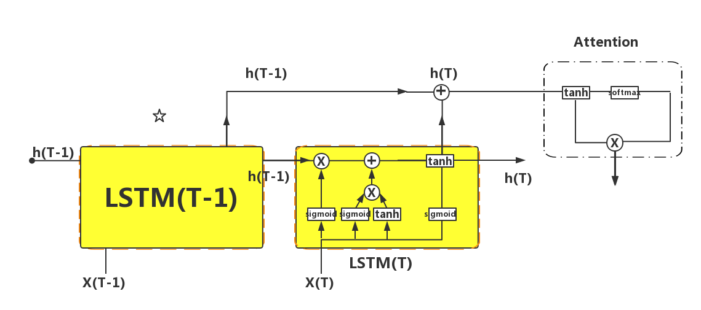
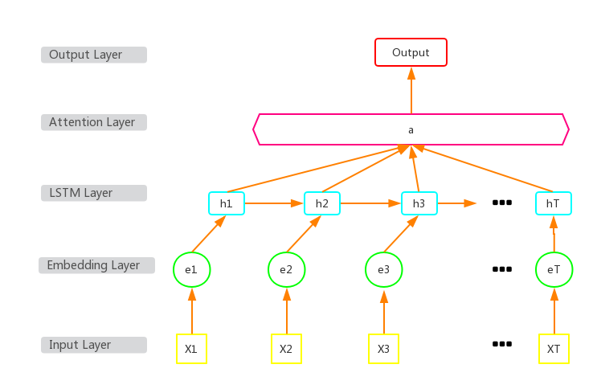

# Deep Learning Models in NLP

> This post is not intened as a guidence for readers to develop good DL models for their NLP task. Rather, it is aimed at thise readers who want a intrduction of DL in NLP.

# NLP task
1. Word Segmentation
2. Information Extraction 
3. Relation Extraction
4. Named Entity Recognition
5. Machine Translation
6. Automatic Summarization
7. Question Answering
8. ...

## Feature representation
> Feature representation is a core technique.

When we deal with NLP task with Deep Learning models, the first thing we should focus on is to represent language fertures. A method is that nature language form should be converd to vectors first so we can put it into input layer.

### One-hot Representation

A simple method is One-hot Representation.
For example, use One-hot representation to represent "i have a pen"   
i      [1 0 0 0]
have   [0 1 0 0]
a      [0 0 1 0]
pen    [0 0 0 1]
It is easy to understand and easy to process data, however, it suffers from two disadvantages.

1. It can be very large in size.
2. It can not represent the relationship between words.

### Distributed Representation
#### word embedding
Another is proposed by Hinton called Distributed Representation.
This representation method is dense comparing to One-hot Representation, the basic idea is to map words to size fixed(normally 50~200, it is very short comparing to One-hot Repressentatin) vectors, then put all these vectors together to construct a word vector space. We can see that each word becaome a point in the vector space and its extremely useful(e.g. the distance between words can be calculated which contains lots of information, near distance means close relationship)

In general, when we train a language model, word embeddings can be trained at the same time.

#### sentence embedding

word embeddings have proven to be powerful in many NLP tasks, however , are not optimized specilally for representing sentences. In this case, sentence embedding is proposed for two reasons: Word embeddings are usually not task-spcific while sentence embedding can obtain more specific information for different tasks. Anothier reason is that sentence embedding can contain more complete information for representing sentence.

Aimming at optimizing  word  embeddings  for sentence representations. Useful senten embedding method was proposed(Tom Kenter and Alexey Borisov 2016). They present Siamese CBOW, an efficient neural network architecture for obtaining high-quality word embeddings,  directly  optimized  for  sentence representations.
The Siamese CBOW rovides a robust way of generating high-quality sentence. 

#### other embedding
English consists of words, so English NLP task is on words level. Chinese fundamental units are  Chinese character. Generally, Chinese words can be divided into different Chinese character so we can get character embeddings instead of word embedding. Because each Chinese character has its own meanning, sometimes, result can be surprisingly good when use character embeddings as basic input.(e.g. copora data are very small)

#### RNNLM--Mikolov
In <Recurrent neural network based language model> Mikolov use RNN to train language model. The biggest advantage of RNN language model is that it can make good use of words' infornamtion, it can make use of contex, we can see in figure 1, RNN can catch history informations.

Such approaches
are time- and memory-intensive
because of the large numbers of parameters
for word embeddings and the output
layer.

## Word vectors for sentimen analysis

# Attention Based LSTM Language Model
Deep Learning based language models have been became very powerful language models comparing to tradition models such as n-grame model.

There are some challenges in sentiment analysis, one of them is that sentiment information can appear at any position in the sentence. To tackle these problem, I choose Attention Based LSTM Language Model to deal with a sentimen analysis task.
Given a movie review, the model attempts to predict whether it is positive or negative
## Model
> Input layer: movie reviews from the Large Movie Review Dataset[2]
> Embedding layer: map each sentence into a vectors.
> LSTM layer: capture features from sentence embeddings.
> Attention layer: merge word-level features from each time step.
> Output layer: merge information from all time step by using Sigmoid from sentimen classification.

the weight vector;
# problem
the biggest problem i faced is that how to map word into appropiate vector.
[1] Siamese CBOW: Optimizing Word Embeddings for Sentence Representations
[2] http://ai.stanford.edu/~amaas/data/sentiment/